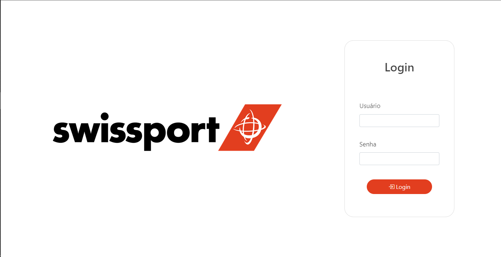

# Trabalho de Conclusão de Curso - Sistema de Gerenciamento de Equipamentos de Segurança

Este projeto foi conceituado em um gerenciador de equipamentos de segurança para funcionários. Nenhum dado compartilhado é usado pela empresa em destaque.

Este projeto não foi comercializado e é apenas um protótipo acadêmico para o trabalho de conclusão de curso de "Técnico em Informática" da Escola Técnica de Brasília - ETB.

Este projeto não foi criado somente por mim, mas também com ajuda dos meus colegas de grupo, que estão citados na documentação e no rodapé deste readme.

Para este projeto funcionar, é necessário possuir:
JDK 11 ou superior;
Apache Netbeans compatível com a JDK acima;
Apache Tomcat 8 ou superior;
É preciso ativar uma conexão local ao banco de dados mysql (use o xampp, nesta ocasião).

## Tela inicial

## Tela Home (Admin)

.png)

## Tela Home (Outros Usuários)

.png)

---
## Contribuidores:

Gabriel Peres de Oliveira

João Vitor Lima Ferreira de Carvalho

Larissa Batista Sousa Silva

Mateus Vale Cruz

Saul Medeiros da Silva

---
Documentação completa se encontra 👉[aqui](documentação_tcc.pdf)👈
